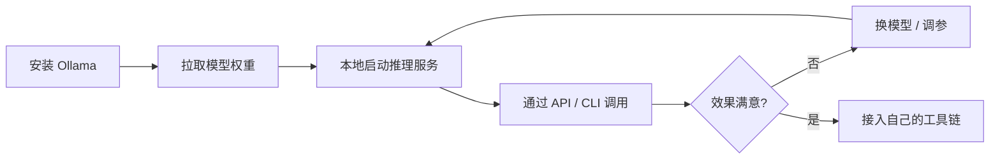

# 折腾笔记：在本地部署开源大语言模型踩坑记 🧠

距离上一篇「开张贴」已经过去一周多了。这一周除了日常工作，几乎所有的业余时间都花在了同一件事上——**把一个开源大语言模型完整地跑在自己的机器上**。这篇文章就把整个过程从头到尾记录一遍，方便以后回顾，也希望能帮到同样想折腾的你。

> ⚠️ 提前声明：本文不是"5 分钟教你部署 LLM"的速成教程，而是一次相对啰嗦、包含大量弯路的*真实记录*。如果你只想要最短路径，直接跳到[「环境搭建步骤」](#环境搭建步骤)就够了。

## 为什么想要在本地跑大模型

先说说动机，主要是这几点：

1. **隐私**：有些内容我不太放心丢给云端 API，比如：
   - 私人日记和随笔
   - 公司内部的代码片段
   - 还没公开的项目想法
2. **成本**：长期高频调用云端接口，token 费用积少成多，不如一次性投入硬件；
3. **离线可用**：出差、坐飞机的时候网络时断时续，本地模型不受影响；
4. **纯粹是想学习**：想搞清楚从"下载权重文件"到"输出第一个 token"之间到底发生了什么。

## 硬件与环境准备

跑大模型，硬件是绕不开的第一道坎。下面是我出发前做的一张"心里有数"表格：

| 模型规模（参数量） | 量化精度 | 预估显存需求 | 我的显卡是否够用 |
| :--- | :---: | ---: | :---: |
| 7B | Q4_K_M | 约 4–5 GB | ✅ |
| 13B | Q4_K_M | 约 8–9 GB | ✅ |
| 34B | Q4_K_M | 约 20 GB | ⚠️ 勉强 |
| 70B | Q4_K_M | 约 40 GB+ | ❌ |

我自己的测试机配置大致是：

- CPU：一颗还算年轻的桌面级处理器
- GPU：24 GB 显存的消费级显卡
- 内存：64 GB
- 硬盘：预留了将近 1 TB 专门放模型权重（~~事后证明明显不够~~）

开工之前，先确认驱动和环境是否正常：

```bash
# 确认显卡驱动和显存占用
nvidia-smi

# 确认 CUDA 版本
nvcc --version
```

> 💡 **小提示**：如果 `nvidia-smi` 直接报错，先别急着重装驱动，==大概率是内核更新后驱动没有正确匹配==，重启一次往往就能解决一半的问题。

## 方案调研：候选工具对比

跑大模型的"壳子"有很多选择，我主要对比了下面几个：

| 工具 | 易用性 | 性能 | 是否需要写代码 | 适合人群 |
| :--- | :---: | :---: | :---: | :--- |
| **Ollama** | ⭐⭐⭐⭐⭐ | ⭐⭐⭐⭐ | 否 | 追求开箱即用 |
| llama.cpp | ⭐⭐⭐ | ⭐⭐⭐⭐⭐ | 视情况 | 想抠到极致性能 |
| LM Studio | ⭐⭐⭐⭐⭐ | ⭐⭐⭐⭐ | 否 | 喜欢图形界面 |
| text-generation-webui | ⭐⭐⭐ | ⭐⭐⭐⭐ | 有一点 | 想要更多参数可调 |

最终我选择了先用 **Ollama** 跑通流程，因为它把 llama.cpp 的能力包了一层非常友好的壳，命令行体验也很顺手。后面如果想抠性能，再考虑直接上 llama.cpp。

<details>
<summary>如果你对 Ollama 和 llama.cpp 的关系感到好奇，点开看看</summary>

简单来说，Ollama 底层的推理能力正是基于 `llama.cpp` 构建的，Ollama 在上面做了模型管理（类似 `docker pull` 的体验）、API 封装和一些易用性上的优化，让你不需要自己手动编译、手动拼接命令行参数。

</details>

## 环境搭建步骤

整个搭建过程可以简化成下面这张流程图：



### 具体操作步骤

落到具体命令上，大致是这几步：

#### 第一步：安装 Ollama

```bash
curl -fsSL https://ollama.com/install.sh | sh
```

#### 第二步：拉取一个模型

```bash
ollama pull qwen2:7b
```

#### 第三步：直接对话测试

```bash
ollama run qwen2:7b
```

#### 第四步：以 API 形式调用

这一步是我觉得最实用的，方便接入自己写的小工具：

```python
import requests

response = requests.post(
    "http://localhost:11434/api/generate",
    json={
        "model": "qwen2:7b",
        "prompt": "用一句话总结今天的天气适不适合出门",
        "stream": False,
    },
)

print(response.json()["response"])
```

如果想让模型作为后台服务一直挂着，写一份简单的 `docker-compose.yml` 会更省心：

```yaml
version: "3.8"
services:
  ollama:
    image: ollama/ollama
    ports:
      - "11434:11434"
    volumes:
      - ollama_data:/root/.ollama
    deploy:
      resources:
        reservations:
          devices:
            - driver: nvidia
              count: 1
              capabilities: [gpu]

volumes:
  ollama_data:
```

## 一点点数学：量化和显存的关系

选模型的时候绕不开"量化"这个概念，这里稍微展开算一下。一个模型的显存占用，粗略可以用这样一个公式估算：

$$
\text{显存占用（GB）} \approx \frac{\text{参数量} \times \text{每参数比特数}}{8 \times 1024^3}
$$

举个例子，一个 7B（即 $7 \times 10^9$）参数的模型，使用 4-bit 量化（也就是常说的 `Q4`）时：

$$
\frac{7 \times 10^9 \times 4}{8 \times 1024^3} \approx 3.26 \text{ GB}
$$

再加上上下文缓存（KV Cache）和推理框架本身的开销，实际占用通常会比这个理论值高出 20%–40%，这也是为什么表格里我给 7B 模型留了 4–5 GB 的余量。

## 踩坑记录

理想很丰满，过程很骨感。按照踩坑的顺序，简单罗列一下这次折腾中遇到的问题：

- [x] 显卡驱动版本与 CUDA 版本不匹配，报错 `CUDA driver version is insufficient`
- [x] 第一次拉取模型时网络中断，权重文件损坏，重新下载后才解决
- [x] 忘记开放防火墙端口，局域网内其他设备连不上 API
- [ ] 长上下文场景下显存溢出（还在研究怎么优化，欢迎懂的朋友指教）
- [ ] 多模型同时加载时的显存调度策略

> 之前在论坛里刷到一个类似的踩坑帖，楼主提到：
>
> > 光是解决 CUDA 版本问题，就花掉了一整个周末。
>
> 深有同感。

其中最让人抓狂的是防火墙那个问题，报错信息长这样：

```text
Error: connect ECONNREFUSED 192.168.1.xxx:11434
```

排查了快一个小时，最后发现只是少开了一条 `ufw` 规则：

```bash
sudo ufw allow 11434/tcp
```

写到这里，喝掉的咖啡和 H<sub>2</sub>O 数量已经不可考了，但可以确定的是——==显著多于日常水平==。如果说这次折腾要我总结一条经验，那就是：***显卡驱动，永远是万恶之源***。

## 性能测试结果

简单跑了几组基准测试，记录一下不同配置下的表现（仅供参考，实际效果和 prompt、上下文长度都有关系）：

| 模型 | 量化 | 首 Token 延迟 | 生成速度 |
| :--- | :---: | ---: | ---: |
| Qwen2-7B | Q4_K_M | ~0.3 s | ~45 tokens/s |
| Qwen2-7B | Q8_0 | ~0.4 s | ~30 tokens/s |
| Llama-3-8B | Q4_K_M | ~0.35 s | ~40 tokens/s |

> 📌 这些数字都是我自己机器上跑出来的，**不同硬件下差异会很大**，建议大家以自己实测为准，别直接照搬别人的跑分。

为了直观一点，找了张类似场景下的工作站照片作为本文配图：


## 后续计划

这次折腾只能算是"跑通"，离"好用"还有距离。接下来打算做的事情：

1. [ ] 把 Ollama 接入到自己的笔记软件里，实现本地知识库问答
2. [ ] 尝试手动编译 `llama.cpp`，对比性能差异
3. [ ] 研究一下多卡并行推理
4. [ ] 写一篇关于 RAG（检索增强生成）的实践笔记[^1]

## 总结

整体折腾下来，最大的感受是：本地部署大模型这件事，**入门的门槛远比想象中低**，Ollama 这类工具已经把体验打磨得相当友好；但如果想追求极致的性能和效果，后面还有相当长的一段路要走。

这篇笔记就先写到这里，如果你也在折腾类似的东西，欢迎交流。

---

## 参考资料

- [Ollama 官方文档][ollama-doc]
- [llama.cpp 项目仓库][llamacpp-repo]
- [Hugging Face 模型库][hf-hub]

[ollama-doc]: https://ollama.com "Ollama"
[llamacpp-repo]: https://github.com/ggerganov/llama.cpp "llama.cpp on GitHub"
[hf-hub]: https://huggingface.co/models "Hugging Face Models"

[^1]: RAG 全称 Retrieval-Augmented Generation，简单说就是让模型在回答前先"翻书"，这部分内容留到下一篇细讲。
